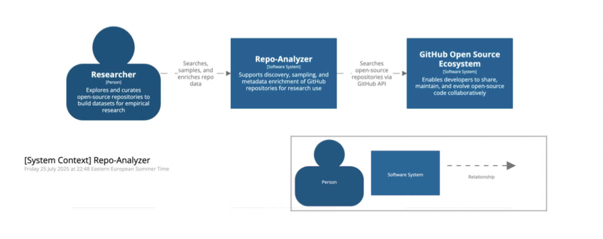

# 📊 Repo Analyzer

**Repo Analyzer** is a full-stack web application that helps researchers identify, sample, and analyze open-source repositories from GitHub.

It provides tools to:

- Search and filter repositories using the GitHub Search API
- Generate statistically valid random samples
- Enrich repository metadata (e.g. code coverage rates)

The goal is to simplify and automate the process of preparing open-source repositories for empirical software engineering research.

---

## 1. System Overview

The following C4 Level 1 diagram illustrates the system context of Repo Analyzer, highlighting its key users and external dependencies.




This diagram shows the high-level context in which the Repo Analyzer system operates.

- Researcher: The primary user of the system. Researchers are interested in identifying, sampling, and analyzing GitHub repositories to build curated datasets for empirical software engineering studies.

- Repo Analyzer: This is the core software system, offering tools to:

    - Search and filter repositories using the GitHub Search API,
    
    - Generate statistically sound samples,
    
    - Enrich metadata (e.g., with code coverage, commit history, contributor data).

- GitHub Open Source Ecosystem: An external system that the application integrates with. GitHub provides the raw data (repositories and their metadata) via its public APIs.

The Repo Analyzer acts as a bridge between researchers and GitHub, simplifying and automating workflows involved in preparing open-source datasets for research purposes.

---

## 1. Installation

The project consists of a **Java-based backend** and an **Angular-based frontend**, both co-existing within the same repository. Follow the setup instructions for each part below.

### 1.1. Frontend (Angular)

The following versions of external tools are used in this project to ensure compatibility and stability. It’s recommended to match these versions as closely as possible to avoid unexpected issues during development or build:

- **Node.js** v22.12.0 or higher  
- **npm** v10.9.0 or higher  

#### 1.1.1. Key Frontend Dependencies
The following are the main libraries and tools used in the frontend stack (as defined in `package.json`):

- **Angular** v18.0.0 (`@angular/*`)
- **Angular CLI** v18.0.0
- **Angular DevKit** v18.0.0
- **TypeScript** v5.4.5
- **RxJS** v7.8.0
- **Zone.js** v0.14.0
- **TSLib** v2.3.0
- **ESLint** v8.57.x
- **@angular-eslint** suite v20.1.1
- **@typescript-eslint** suite v7.11.0

**Note:** Make sure to keep these versions consistent to avoid compatibility issues


#### 1.1.2. Install & Run in Development Mode

From the project root, navigate to the `frontend` directory and install the required packages:

```
cd frontend
npm install
```

To start the development server with live reload, run the following from the `frontend` directory:

```
npm start
```

The app will be available at `http://localhost:4200`.
Any changes to source files will trigger an automatic reload.

**Note:** The frontend application depends on the backend service being up and running.

The Angular development server is configured to proxy API requests (i.e. requests to `/api/**`) to the backend which is expected to run on `8080` port.

Thus, if the backend is running on a different port or host, make sure to update the `target` field in `proxy.conf.json` accordingly.


#### 1.1.3. Build for Production

To build the frontend application for production, use the provided `build-and-copy.sh` script located in the project root:

```
./build-and-copy.sh
```

This script performs the full build pipeline:

- Installs frontend dependencies using `npm install`
- Runs the Angular production build (`npm run build`), outputting to the `/frontend/dist` directory
- Performs necessary checks and folder validations
- Copies the built artifacts into the `src/main/resources/static` directory of the Java backend

This setup allows the Angular frontend to be bundled directly into the Spring Boot executable JAR. When the backend is run, the frontend is served seamlessly from the same server, making it accessible as part of the overall web application (e.g., via `http://localhost:8080`).


### 1.2. Backend (Java/Spring boot)

---

## 2. Architecture


---

## 3. Features

---

## 4. License


